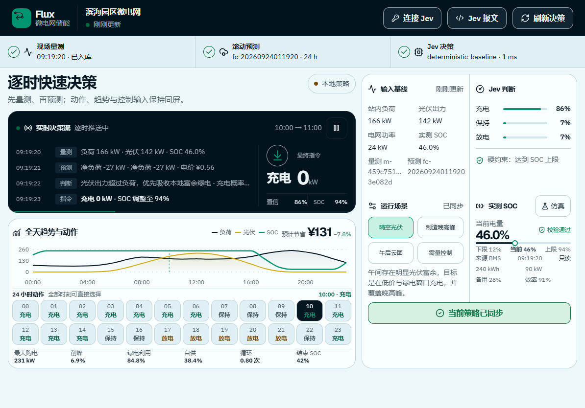

# Flux · 微电网储能逐时决策

面向 iPad 的微电网储能控制界面。系统先接收现场量测，再基于该量测生成并提交日内滚动预测；Jev 对未来 24 小时逐时输出 `charge / hold / discharge` 类型化判断、概率分布与置信度，确定性调度引擎负责执行功率、SOC、效率和备用容量等硬约束。



## 运行

要求 Node.js 20 或更高版本，并在服务端环境中配置 `TYPESAFE_API_KEY`。

```powershell
npm install
npm run dev
```

开发服务默认打开 <http://127.0.0.1:5173>。如果环境变量刚写入，请先新开一个终端再启动。

生产模式：

```powershell
npm run build
npm start
```

生产服务默认运行在 <http://127.0.0.1:8787>。

## 生产式输入链路

系统不会把现场状态和未来预测一次性塞进同一个请求，而是按时间顺序处理：

1. `POST /api/measurements`：上传当前时刻的负荷、光伏、电网交换功率、储能功率和 SOC；服务返回 `measurementId`。
2. 预测服务以该量测为基准生成滚动预测。
3. `POST /api/dispatch/forecast`：提交 `measurementId`、预测批次信息及 24 小时负荷/光伏/电价序列，触发逐时调度。

调度接口会拒绝不存在、站点不匹配、超过 15 分钟或预测签发时间早于量测时间的量测基准。旧版 `POST /api/dispatch` 仍保留，供现有界面兼容调用。

当前演示将量测回执保存在服务进程内存中，重启后清空。生产部署应替换为 MQTT/Kafka 等采集链路与时序数据库或持久化状态仓库，但可保持上述报文契约不变。

## 功能

- iPad 横屏侧边栏、主决策台和右侧输入检查器，1024/1194 宽度下一屏展示核心信息。
- UI 真实执行“量测入库 → 滚动预测 → Jev 决策”，展示每阶段状态与追踪 ID。
- 三个可切换场景：晴空高光伏、制造晚高峰、午后光伏骤降。
- 场站容量、功率和备用 SOC 作为只读硬约束；测试模式仅调整下一轮模拟量测 SOC。
- 24 小时负荷、光伏、电网、储能功率和 SOC 联合图表。
- Jev 每小时动作、完整概率分布、置信度和模型信息。
- 日运行成本、节省、削峰、绿电利用率、自供率和等效循环指标。
- 首屏、连接失效和主动断开后只显示 Jev 连接准备页；不会自动生成本地基线、量测、预测或充放电结果。连接验证完成后仍需明确点击“开始逐时决策”。

## Jev 的职责边界

后端把“已观测状态”和“未来预测”作为两个具名的结构化 state 传给 Jev，并在一次 `systemOne` 请求中并行提交 24 个 `Choice` 问题。Jev 比较各时段动作的语义价值，代码负责：

- 量测先于预测的时序校验；
- 逐时 AC 能量平衡；
- 最大充放电功率；
- 最小、最大和备用 SOC；
- 往返效率；
- 禁止储能向电网反送；
- 成本和运行指标计算。

这遵循“模型给判断、代码做执行”的设计。服务端环境密钥不会进入浏览器 bundle 或报文截图；用户自带密钥会经一次性 HTTPS 请求换取短期会话，不会被加入调度报文或 Jev trace。

## Jev 连接与公开部署安全

界面可以让用户输入自己的 Jev API Key，但它不是浏览器的长期凭据管理器：Key 只作为写入式输入提交给 HTTPS 后端校验，后端以不透明的 32 字节会话令牌响应。浏览器应仅在当前页面内存中保存该令牌，并通过 `X-Jev-Session` 发送；不能使用 LocalStorage、SessionStorage、URL、分析事件或日志保存 Key / 令牌。

- `POST /api/jev/session`：后端用 `models.list()` 校验 Key，随后仅在本进程内存中保存它。返回的 `connectionToken` 不包含 Key。
- `GET /api/jev/session`：只返回安全的连接状态、绝对到期时间和剩余调用数。
- `DELETE /api/jev/session`：立即撤销该临时会话；服务重启也会清空所有此类会话。
- 会话绝对有效期最长 15 分钟、空闲最长 5 分钟；校验端点和 Jev 调度均有进程内限流。过期、篡改或空会话令牌会得到 `401 jev_session_expired`，**不会**回退使用 `TYPESAFE_API_KEY`。
- API 响应采用 `no-store`，并附带来源校验、精确 CORS allowlist、拒绝 iframe、禁用嗅探和最小权限头；上游 Jev 错误不会原样返回页面。

GitHub Pages 只能托管静态前端，不能安全地保存或代理 Jev Key。公开部署时请将 Express API 放在独立、受 HTTPS 保护的服务上，并配置：

```dotenv
# API 服务的私有环境，不放入 GitHub Actions、Vite 或 Pages 构建变量
JEV_ALLOW_ENVIRONMENT_KEY=false
CORS_ALLOWED_ORIGINS=https://your-github-user.github.io
TRUST_PROXY=1
NODE_ENV=production
```

`JEV_ALLOW_ENVIRONMENT_KEY=false` 很关键：即便 API 服务本身配置了 `TYPESAFE_API_KEY`，匿名 Pages 访客也无法消耗部署者的 Key，必须创建自己的临时会话。生产环境默认也是关闭的；只有明确设置为 `true` 才会让 API 使用部署者的环境变量 Key。若使用 Vite 的 `VITE_API_BASE_URL` 指向该 API，它只能是公开的 HTTPS API 地址；任何以 `VITE_` 开头的变量都会进入前端构建产物，绝不能放入 Key。反向代理、CDN 与应用日志同样必须禁用请求体记录，并脱敏 `X-Jev-Session`，再在 API 前增加身份认证、WAF / 边缘限流和监控告警。

该设计降低了无意持久化与公开站点滥用风险，但无法抵御已被恶意脚本、浏览器扩展或用户设备入侵的页面环境。高权限或生产账户仍应使用受身份认证的后端、最小权限 Key 和可撤销的短期凭据。

## GitHub Pages 发布

仓库包含 [`.github/workflows/deploy-pages.yml`](.github/workflows/deploy-pages.yml)。它只构建并发布 Vite 的 `dist` 静态产物；不会向 GitHub Actions、Pages 或前端 bundle 注入 `TYPESAFE_API_KEY`、Jev Key 或会话令牌。

首次发布前：

1. 在仓库 **Settings → Secrets and variables → Actions → Variables** 创建 `JEV_API_BASE_URL`，值为独立 API 服务的公开 HTTPS 地址，例如 `https://api.example.com`。这是公开地址，不是密钥；工作流会将其映射到构建时的 `VITE_API_BASE_URL`。
2. 在该 API 服务配置 `JEV_ALLOW_ENVIRONMENT_KEY=false`、`TRUST_PROXY=1`，并把 `CORS_ALLOWED_ORIGINS` 精确设为 `https://<owner>.github.io`。注意 Origin 不包含项目站点的仓库路径。
3. 在仓库 **Settings → Pages** 选择 **GitHub Actions** 作为 Source，然后推送 `main`。工作流通过 Pages 提供的 base path 自动构建项目站点，例如 `https://<owner>.github.io/<repository>/`。

如果未设置 `JEV_API_BASE_URL` 或地址不是 HTTPS，工作流会在上传前失败，而不是发布一个会把 Jev 请求错误发往 GitHub Pages 的页面。

## 报文样例

- `artifacts/microgrid-measurement.json`：实时量测输入。
- `artifacts/microgrid-forecast-request.json`：携带 `measurementId` 的预测请求。
- `artifacts/microgrid-dispatch-response.json`：完整 24 小时调度输出。
- `artifacts/microgrid-terminal-request.png`：两阶段终端输入截图。
- `artifacts/microgrid-terminal-response.png`：终端输出截图。

## 验证

```powershell
npm run test
npm run build
```

测试覆盖量测/预测时序、量测 SOC 作为预测基线、功率与 SOC 边界、逐时能量平衡，以及低价充电和晚峰放电行为。

## 重要说明

本项目用于算法测试和产品演示，不包含设备通信、保护定值、预测校准或生产级优化器，不应直接控制真实储能设备。生产落地前应使用现场数据验证 Jev 判断阈值，并接入 EMS 的安全联锁、审批和回滚机制。
